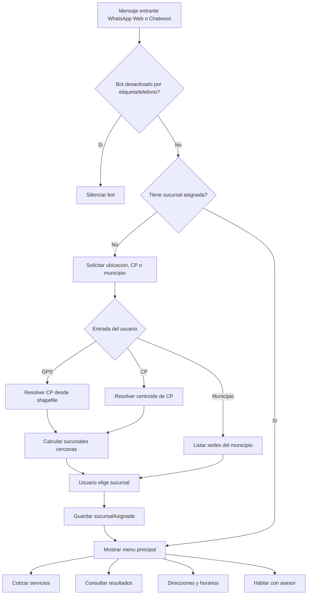

# Implementacion de Flujos del Chatbot

Fecha: 2026-06-23

Este documento describe lo que se esta realizando en el chatbot de Laboratorios Napoles para llevarlo hacia la matriz de flujos nueva.

## Objetivo

Reestructurar el bot para que el flujo principal sea:

1. Detectar ubicacion del paciente.
2. Asignar sucursal mas cercana.
3. Mostrar menu principal segun sucursal.
4. Permitir cotizar servicios.
5. Permitir consultar resultados.
6. Mostrar direcciones/horarios.
7. Escalar con asesor.

## Flujo General Esperado



## Cambios Ya Aplicados

### 1. Sucursales remotas

Archivo: `src/services/sucursales.js`

Antes:

- Las sucursales estaban como datos duros en el codigo.

Ahora:

- Se descargan desde:
  `https://raw.githubusercontent.com/napoles-desarrollo/sucursales/refs/heads/main/listasucursales.json`
- Se cachean en memoria.
- Si una sucursal asignada no tiene `lista_precio`, cotizacion fuerza una
  recarga y rehidrata el objeto antes de declararlo no disponible.
- Se mantiene la estructura:
  `Estado -> Municipio -> Sucursales[]`.
- Cada sucursal se homologa a un contrato unico con `id` numerico, textos
  vacios convertidos a `null`, coordenadas numericas y contexto `estado/municipio`.
- `mapa_movil` usa el formato universal de indicaciones de Google Maps
  para abrir navegacion desde Android, iPhone o navegador movil.
- Si `mapa_movil` no es realmente una URL de mapas, se descarta y se genera
  una ruta de Google Maps desde las coordenadas.
- `lista_precio` contiene el `IdListaPrecio` numerico usado para cotizaciones.
- Cuando faltan coordenadas explicitas, se intentan recuperar del iframe de mapa.

Importante: el campo `id` del JSON no equivale necesariamente al
`IdSucursal` de SQL. Para consultar precios debe usarse `lista_precio`.

Estado de publicacion al 2026-06-23: la rama `main` remota contiene 40
sucursales, pero solo Villahermosa tiene `lista_precio`; las otras 39 siguen
pendientes. Su `mapa_movil` publicado apunta a un logo, por lo que el servicio
lo reemplaza en memoria con una ruta generada desde coordenadas. El catalogo
completo sigue preparado en `codex/add-sucursal-fields`.

Estado del catalogo homologado:

```txt
3 estados
22 municipios
40 sucursales
39 sucursales con coordenadas
1 sucursal sin coordenadas
```

Sucursal Arena sigue apareciendo en busquedas por municipio, pero no participa
en el calculo de proximidad hasta contar con coordenadas.

### 2. Configuracion nueva

Archivo: `src/config/index.js`

La configuracion carga `.env` mediante `dotenv` y despues lee `process.env`.
`.env.example` contiene el contrato completo sin credenciales y `.gitignore`
evita publicar el archivo real. El modo de prueba con WhatsApp Web no requiere
`CHATWOOT_BOT_TOKEN`; solo valida credenciales SQL porque ya ejecuta consultas
reales. El token de Chatwoot solo se exige al arrancar el webhook con
`npm run start:chatwoot`.
La ruta se resuelve desde `src/config`, no desde la terminal, por lo que funciona
tanto al ejecutar desde `chatbot` como desde `chatbot/src`.

Variables agregadas:

```env
SUCURSALES_DATA_URL=
CP_SHAPEFILE_BASE=src/utils/CP_Tab/CP_Tab
CP_SHAPEFILE_BASES=
DB_USER=
DB_PASSWORD=
DB_SERVER=
DB_DATABASE=
DB_PORT=1433
TOP_STUDIES_FROM=2026-01-01
TOP_STUDIES_LIMIT=5
API_BASE_URL=
API_TOKEN=
PORTAL_SALUD_URL=
BOT_DISABLED_LABELS=
BOT_DISABLED_PHONES=
```

### 3. Flujo por ubicacion o CP

Archivos:

- `src/services/geo.js`
- `src/handlers/flujoSucursales.js`
- `src/handlers/commands.js`
- `src/app.js`

Capacidades:

- Detecta ubicacion compartida en payload del webhook.
- Detecta CP de 5 digitos.
- Convierte CP a coordenadas usando uno o varios shapefiles `*.shp/*.dbf`.
- Detecta CP a partir de GPS.
- Calcula sucursales mas cercanas.
- Permite elegir sucursal cercana.
- Guarda `sucursalAsignada`.
- En WSL convierte rutas tipo `C:\...` a `/mnt/c/...` cuando aplica.
- Si la ruta configurada no existe, intenta usar el shapefile empaquetado en
  `src/utils/CP_Tab/CP_Tab`.

Casos probados:

```txt
Entrada: 86099
Resultado: Sucursal Villahermosa aprox. 6.1 km

Entrada: GPS Matriz/Tamulte
Resultado: CP 86150, Sucursal Villahermosa a 0 m
```

### 4. Menu principal actualizado

Archivo: `src/handlers/commands.js`

Menu actual:

```txt
1. Cotizar servicios
2. Consultar resultados
3. Direcciones y horarios
4. Hablar con asesor
```

El menu solo aparece despues de asignar sucursal.

### 5. Catalogo con SQL directo

Archivos:

- `src/services/catalogo.js`
- `src/services/database.js`
- `src/services/aliasesEstudios.js`

Los handlers no contienen SQL. `CatalogoService` resuelve alias y delega en
`GestorBaseDatos`, que ejecuta consultas parametrizadas por `IdListaPrecio`:

```js
catalogo.buscarEstudios(...)
catalogo.obtenerMasSolicitados(...)
catalogo.cotizar(...)
```

El top usa demanda global desde `TOP_STUDIES_FROM`, pero solo devuelve estudios
con precio activo en la lista de la sucursal elegida. La fecha se compara sin
convertir `RecepcionEstudio.FechaCreacion`, para permitir uso de indice.

### 6. Prueba con WhatsApp Web

Archivo: `src/wa-test.js`

- Reutiliza el mismo `ManejadorComandos` y los flujos del chatbot.
- No depende de Chatwoot.
- Es el modo principal mientras se esta afinando el flujo.
- Detecta notas de voz/audio, las descarga, las transcribe con `whisper.cpp`
  y reinyecta el texto al mismo flujo como si el paciente lo hubiera escrito.
- Usa las mismas consultas SQL, alias y flujo de cotizacion que el webhook.
- Ignora estados, canales, listas de difusion y grupos de WhatsApp.
- Protege el mensaje de contingencia para evitar cierres por errores de envio.
- Se inicia con `npm start` o `npm run wa:test`.
- `node src/app.js` queda reservado para Chatwoot y requiere
  `CHATWOOT_BOT_TOKEN`.
- Las variables opcionales pueden configurarse desde Windows/WSL mediante
  `process.env`.
- En WSL, Puppeteer necesita librerias Linux para abrir Chrome. Si aparece
  `error while loading shared libraries: libnspr4.so`, instalar dependencias:

```bash
sudo apt update
sudo apt install -y ca-certificates fonts-liberation libasound2 libatk-bridge2.0-0 libatk1.0-0 libcairo2 libcups2 libdbus-1-3 libexpat1 libfontconfig1 libgbm1 libglib2.0-0 libgtk-3-0 libnspr4 libnss3 libpango-1.0-0 libpangocairo-1.0-0 libx11-6 libx11-xcb1 libxcb1 libxcomposite1 libxcursor1 libxdamage1 libxext6 libxfixes3 libxi6 libxrandr2 libxrender1 libxss1 libxtst6 xdg-utils
```

- Si se quiere usar un Chrome/Chromium instalado por el sistema, definir
  `PUPPETEER_EXECUTABLE_PATH=/ruta/al/chrome`.

## Estado Actual

### Cotizacion

Estados definidos:

```txt
cotizacion_tipo_servicio
cotizacion_forma_busqueda
cotizacion_buscar_estudio
cotizacion_confirmar_estudios
cotizacion_post_cotizacion
```

Flujo implementado en esta etapa:

1. Usuario elige `Cotizar servicios`.
2. Bot pregunta forma:
   - Buscar por nombre
   - Mas solicitados
   - Hablar con asesor
3. Bot busca estudios con SQL y aplica el diccionario de alias.
4. Bot muestra coincidencias o el top 5.
5. Usuario selecciona un estudio.
6. Bot consulta el precio activo por `lista_precio`.
7. Bot muestra:
   - precio por estudio;
   - total;
   - sucursal;
   - opciones de cotizar otro/menu/asesor.

Consultas implementadas:

```txt
buscarEstudios({ texto, listaPrecioId, estudioIds })
obtenerEstudiosMasSolicitados({ listaPrecioId, fechaDesde, limite: 5 })
cotizarEstudios({ listaPrecioId, estudios })
```

Pendiente para completar la matriz: cotizacion acumulada de varios estudios,
clasificacion confiable por laboratorio/ultrasonido/rayos X, preparacion y
tiempo de entrega.

### Resultados

Estados definidos:

```txt
resultados_metodo_busqueda
resultados_esperando_dato
resultados_accion
```

Flujo pendiente de terminar:

1. Usuario elige `Consultar resultados`.
2. Bot pregunta metodo:
   - Folio
   - Expediente
   - Telefono registrado
   - Hablar con asesor
3. Bot consulta API/SQL.
4. Si no liberado:
   - explica que esta en proceso;
   - permite consultar otro o asesor.
5. Si liberado:
   - ofrece descargar PDF;
   - ofrece Portal Salud;
   - permite consultar otro o finalizar.

API esperada:

```txt
GET /resultados?folio=0163538
GET /resultados?expediente=12345
GET /resultados?telefono=9931234567
```

### OCR y audio

Pendiente:

- Servicio `media.js` para descargar adjuntos de Chatwoot.
- Servicio `ocr.js` para procesar imagen/PDF.
- Integrar `speech.js` tambien al webhook de Chatwoot cuando tengamos
  payloads reales de audio.

Implementado en WhatsApp Web:

- `src/services/speech.js` convierte audio a WAV 16 kHz mono con `ffmpeg`.
- Ejecuta `whisper-cli` en idioma `es`.
- Lee la transcripcion y la pasa a `ManejadorComandos`.
- Frases como `quiero cotizar`, `quiero consultar resultados` o
  `dame la direccion de Centla` entran al detector de intencion existente.

## Asentamientos y Alias

El shapefile actual de Tabasco contiene poligonos por CP, pero el DBF solo trae:

```txt
d_cp
```

Para tres estados hay dos opciones:

```env
CP_SHAPEFILE_BASES=src/utils/CP_Tab/CP_Tab,src/utils/CP_Chis/CP_Chis,src/utils/CP_Ver/CP_Ver
```

o una fuente nacional unica de codigos postales. El bot no adivina poligonos:
si solo existe `CP_Tab`, solo puede resolver CP/GPS dentro de Tabasco.

No trae:

- colonia;
- asentamiento;
- sector;
- localidad;
- aliases.

Para frases como:

```txt
soy de Armenia
sector platano
tamulte
gaviotas
```

se necesita tabla adicional:

```txt
lugares_alias
- alias_normalizado
- nombre_lugar
- cp
- municipio
- estado
- latitud
- longitud
```

## Archivos Relevantes

```txt
src/app.js
src/config/index.js
src/handlers/commands.js
src/handlers/flujoSucursales.js
src/handlers/flujoCotizacion.js
src/handlers/flujoResultados.js
src/services/geo.js
src/services/sucursales.js
src/services/apiClient.js
src/services/catalogo.js
src/services/resultados.js
src/services/state.js
src/wa-test.js
package.json
.env.example
```

## Pendientes Inmediatos

1. Fusionar `codex/add-sucursal-fields` en el repositorio de sucursales.
2. Llenar `.env` con credenciales SQL para pruebas de flujo.
3. Probar contra SQL real los tiempos e indices de las tres consultas.
4. Terminar resultados por expediente/telefono.
5. Incorporar preparaciones, tiempos de entrega y cotizacion de varios estudios.
6. Implementar OCR, audio en Chatwoot y asentamientos.
7. Cuando el flujo este validado, llenar `CHATWOOT_BOT_TOKEN` y probar `npm run start:chatwoot`.

## Nota de Estado

La geolocalizacion por CP/GPS y la cotizacion individual por SQL directo ya
estan conectadas. Las pruebas automatizadas cubren alias, top 5, seleccion y
parametrizacion SQL. Para la etapa actual, el modo principal es WhatsApp Web
con `npm start` o `npm run wa:test`; Chatwoot queda reservado para despues con
`npm run start:chatwoot`. Falta publicar `lista_precio` en todo el JSON remoto.

## Informacion Necesaria Para 95% de Seguridad

Para terminar el flujo completo con seguridad alta, necesito confirmar estos insumos. Algunos ya existen parcialmente, pero conviene fijarlos como contrato para no reescribir despues.

### 1. Consultas directas para cotizaciones

Decision confirmada: el bot consulta SQL Server directamente desde
`src/services/database.js`. Las credenciales viven solo en `.env`; las
consultas usan parametros y nunca interpolan texto ni IDs proporcionados por
el paciente.

Consulta base conocida:

```sql
SELECT
    S.IdSucursal,
    S.Nombre AS Sucursal,
    LP.IdListaPrecio,
    LP.Nombre AS Lista,
    E.IdEstudio,
    E.Nombre AS Estudio,
    LPE.Precio
FROM LAB.ListaDePrecios LP
INNER JOIN LAB.EmpresaListaDePrecio ELP ON ELP.IdListaPrecio = LP.IdListaPrecio
INNER JOIN LAB.ListaDePrecioEstudio LPE ON LPE.IdListaPrecio = LP.IdListaPrecio
INNER JOIN LAB.Sucursal S ON S.IdSucursal = ELP.IdSucursal
INNER JOIN LAB.Estudios E ON E.IdEstudio = LPE.IdEstudio
WHERE
    ELP.IdEmpresa = @idEmpresa
    AND LP.Activo = 1
    AND ELP.Activo = 1
    AND LPE.Activo = 1
    AND S.IdMatriz = @idMatriz
ORDER BY S.Nombre ASC, E.Nombre ASC;
```

Todavia necesito confirmar:

- Si el precio depende de empresa, matriz, sucursal, lista o tipo de paciente.
- Si se pueden cotizar varios estudios en una sola solicitud.
- Si hay estudios sin precio que deben escalarse con asesor.
- Si hay restricciones por sucursal.
- Como se clasifican de forma confiable laboratorio, ultrasonido y rayos X.
- De que tablas salen preparacion y tiempo de entrega.

Respuesta esperada para `GET /catalogo/estudios`:

```json
{
  "items": [
    {
      "id": 123,
      "nombre": "BIOMETRIA HEMATICA",
      "precio": 110,
      "tipoServicio": "laboratorio",
      "preparacion": "Ayuno recomendado de 8 horas",
      "tiempoEntrega": "Mismo dia",
      "score": 0.94
    }
  ]
}
```

Respuesta esperada para `POST /catalogo/cotizar`:

```json
{
  "items": [
    {
      "id": 123,
      "nombre": "BIOMETRIA HEMATICA",
      "precio": 110,
      "preparacion": "Ayuno recomendado de 8 horas",
      "tiempoEntrega": "Mismo dia"
    }
  ],
  "total": 110,
  "moneda": "MXN",
  "vigenteHasta": "2026-06-30"
}
```

### 2. Catalogo de alias, abreviaturas y lenguaje paciente

Implementado inicialmente en:

```txt
src/data/estudios-aliases.json
src/services/aliasesEstudios.js
```

El catálogo se construyó desde `RESULTDOS.csv`, que contiene 1,376
`IdEstudio` únicos sin nombres contradictorios. Los alias guardan siempre el
`IdEstudio`; los términos ambiguos devuelven candidatos y una pregunta de
confirmación.

Para que el bot entienda mensajes como `BH`, `EGO`, `azucar`, `glucosilada`, `perfil`, necesito una tabla o JSON:

```json
[
  {
    "alias": "bh",
    "estudioId": 123,
    "nombreCanonico": "BIOMETRIA HEMATICA"
  },
  {
    "alias": "azucar",
    "estudioId": 456,
    "nombreCanonico": "GLUCOSA"
  },
  {
    "alias": "glucosilada",
    "estudioId": 789,
    "nombreCanonico": "HEMOGLOBINA GLUCOSILADA"
  }
]
```

Necesito confirmar:

- Donde vivira: API, JSON, SQL o archivo local.
- Si los alias aplican a todas las sucursales.
- Si hay alias por tipo de servicio.
- Si se quiere fuzzy search local o que la API devuelva coincidencias ya rankeadas.

Contrato esperado para búsqueda con alias:

```txt
GET /catalogo/estudios?query=GLUCOSA&listaPrecioId=2&estudioIds=1
```

### 3. Estudios mas solicitados

Para el flujo `Los mas solicitados`, necesito:

```json
{
  "laboratorio": [
    { "id": 123, "nombre": "BIOMETRIA HEMATICA" },
    { "id": 456, "nombre": "QUIMICA SANGUINEA 6 ELEMENTOS" }
  ],
  "usg": [
    { "id": 900, "nombre": "ULTRASONIDO OBSTETRICO" }
  ],
  "rayos_x": [
    { "id": 901, "nombre": "RX TORAX" }
  ]
}
```

Necesito confirmar:

- Si la lista cambia por sucursal.
- Si la lista cambia por temporada/promocion.
- Si se ordena por demanda real o lista editorial.

### 4. Preparaciones, restricciones y tiempos de entrega

El Excel pide mostrar preparacion detallada despues de cotizar.

Necesito fuente para:

- preparacion;
- ayuno;
- restricciones;
- tiempo de entrega;
- observaciones;
- si aplica por sucursal o por estudio global.

Formato sugerido:

```json
{
  "estudioId": 123,
  "preparacion": [
    "Ayuno de 8 a 12 horas",
    "Presentar orden medica si cuenta con ella"
  ],
  "tiempoEntrega": "Mismo dia",
  "restricciones": []
}
```

### 5. API o consultas para resultados

El Excel propone buscar por:

- folio;
- expediente;
- telefono registrado.

Actualmente existe una consulta SQL para folio en `src/services/database.js`.

Necesito confirmar si la API entregara:

```txt
GET /resultados?folio=0163538
GET /resultados?expediente=12345
GET /resultados?telefono=9931234567
```

Respuesta esperada:

```json
{
  "folio": "0163538",
  "paciente": "Adrian Arturo G.",
  "sucursal": "Napoles Matriz",
  "fecha": "2025-10-29",
  "disponible": true,
  "estatus": 7,
  "link": "https://...",
  "portalUrl": "https://portal.labnapoles.mx",
  "mensaje": null
}
```

Necesito confirmar:

- Que dato se puede mostrar por privacidad.
- Si se debe enmascarar nombre del paciente.
- Si consultar por telefono puede devolver multiples resultados.
- Que hacer si hay multiples coincidencias.
- Cuanto tiempo vive el link PDF.
- Si se puede regenerar PDF desde API.
- Si Portal Salud es la alternativa oficial.

### 6. Sucursales y unidades

Actualmente se usa:

```txt
SUCURSALES_DATA_URL=https://raw.githubusercontent.com/napoles-desarrollo/sucursales/refs/heads/main/listasucursales.json
```

Necesito confirmar:

- Si este JSON sera la fuente oficial.
- Si se debe migrar a API.
- El `id` del JSON es propio del catalogo y no corresponde a `IdSucursal` de SQL.
- Si `titulo` debe mostrarse tal cual o normalizado.
- Si todas las sucursales tienen coordenadas correctas.
- Si hay unidades que no deben cotizar, solo informar direccion.

Estructura esperada:

```json
{
  "Tabasco": {
    "Centro": [
      {
        "id": 1,
        "titulo": "SUCURSAL VILLAHERMOSA",
        "direccion": "...",
        "telefono": "...",
        "whatsapp": "...",
        "horario_general": "...",
        "latitud": 17.970675435081063,
        "longitud": -92.95695791280816,
        "mapa_movil": "https://www.google.com/maps/dir/?api=1&destination=17.970675435081063%2C-92.95695791280816&travelmode=driving",
        "lista_precio": 2,
        "url_iframe_mapa": "https://..."
      }
    ]
  }
}
```

### 7. Codigos postales y asentamientos

Ya se analizo:

```txt
C:\Users\Kevin Gabriel\Documents\chatbot\src\utils\CP_Tab\CP_Tab.shp
C:\Users\Kevin Gabriel\Documents\chatbot\src\utils\CP_Tab\CP_Tab.dbf
C:\Users\Kevin Gabriel\Documents\chatbot\src\utils\CP_Tab\CP_Tab.prj
```

Sirven para:

- CP -> poligono;
- CP -> centroide;
- GPS -> CP;
- CP/GPS -> sucursal cercana.

No sirven por si solos para:

- Armenia;
- Sector Platano;
- Tamulte;
- Gaviotas;
- nombres de colonias.

Necesito una tabla adicional:

```json
[
  {
    "alias": "armenia",
    "nombre": "Gaviotas Sur Sector Armenia",
    "cp": "86099",
    "municipio": "Centro",
    "estado": "Tabasco",
    "latitud": 17.9699,
    "longitud": -92.9072
  }
]
```

Tambien necesito confirmar si la fuente sera:

- SEPOMEX;
- tabla propia;
- API;
- archivo CSV/JSON;
- shapefile con asentamientos.

### 8. Payloads reales de Chatwoot

Para detectar bien ubicacion, imagenes, PDFs y audios, necesito ejemplos reales del webhook de Chatwoot.

Necesito payload de:

- mensaje de texto normal;
- ubicacion compartida;
- imagen enviada por paciente;
- PDF enviado por paciente;
- nota de voz/audio;
- conversacion con etiquetas;
- conversacion con agente asignado.

Con eso se ajusta `app.js` para leer exactamente los campos correctos.

### 9. OCR

Para OCR necesito decidir:

- Motor: Tesseract local, API externa o servicio propio.
- Ruta donde se guardaran adjuntos temporales.
- Formatos soportados: jpg, png, pdf.
- Idiomas: `spa`, `eng` o ambos.
- Tiempo maximo permitido antes de escalar con asesor.

Flujo esperado:

```txt
adjunto imagen/pdf -> descargar -> OCR -> texto extraido -> detector de intencion
```

### 10. Audio / transcripcion

Para audio se usa `whisper.cpp` via WSL en el modo WhatsApp Web.

Defaults actuales:

```env
AUDIO_TRANSCRIPTION_ENABLED=true
FFMPEG_PATH=ffmpeg
WHISPER_CLI_PATH=~/whisper.cpp/build/bin/whisper-cli
WHISPER_MODEL_PATH=~/whisper.cpp/models/ggml-small.bin
WHISPER_LANGUAGE=es
WHISPER_TIMEOUT_MS=120000
MEDIA_TEMP_DIR=tmp/media
MEDIA_KEEP_FILES=false
```

Para Chatwoot todavia necesito:

- payload real de nota de voz/audio;
- URL o mecanismo exacto para descargar el adjunto;
- confirmar si Chatwoot entrega OGG/Opus, MP3, M4A u otro formato.

Flujo esperado:

```txt
audio -> descargar -> convertir a wav 16k mono -> whisper.cpp -> texto -> confirmar interpretacion
```

### 11. Reglas de escalamiento a asesor

Necesito confirmar reglas:

- Cuando no hay coincidencias de estudio.
- Cuando hay multiples coincidencias ambiguas.
- Cuando falla API.
- Cuando falla OCR.
- Cuando falla audio.
- Cuando el paciente rechaza sucursal sugerida.
- Cuando pide asesor fuera de horario.
- Si se debe crear nota privada siempre.
- Si se debe agregar etiqueta de Chatwoot.

### 12. Rutas locales importantes

Rutas actuales usadas o esperadas:

```txt
C:\Users\Kevin Gabriel\Documents\chatbot
C:\Users\Kevin Gabriel\Documents\chatbot\src\utils\CP_Tab\CP_Tab
C:\Users\Kevin Gabriel\Desktop\Matriz de Flujos Chatbot.xlsx
C:\Users\Kevin Gabriel\Documents\resultado conslta.txt
```

Necesito confirmar si en produccion esas rutas cambiaran. Si cambiaran, deben ir en `.env`.

### 13. Variables de entorno propuestas

```env
CHATWOOT_URL=
CHATWOOT_BOT_TOKEN=
BOT_DISABLED_LABELS=sucursales
BOT_DISABLED_PHONES=

DB_USER=
DB_PASSWORD=
DB_SERVER=
DB_DATABASE=
DB_PORT=1433
DB_ENCRYPT=false
DB_TRUST_SERVER_CERTIFICATE=true

SUCURSALES_DATA_URL=
CP_SHAPEFILE_BASE=src/utils/CP_Tab/CP_Tab
CP_SHAPEFILE_BASES=
TOP_STUDIES_FROM=2026-01-01
TOP_STUDIES_LIMIT=5

API_BASE_URL=
API_TOKEN=
PORTAL_SALUD_URL=

OCR_ENABLED=true
OCR_COMMAND=

AUDIO_TRANSCRIPTION_ENABLED=true
FFMPEG_PATH=ffmpeg
WHISPER_CLI_PATH=~/whisper.cpp/build/bin/whisper-cli
WHISPER_MODEL_PATH=~/whisper.cpp/models/ggml-small.bin
WHISPER_LANGUAGE=es
WHISPER_TIMEOUT_MS=120000
MEDIA_TEMP_DIR=tmp/media
MEDIA_KEEP_FILES=false
```

## Que Se Esta Implementando Ahora

El proyecto se esta moviendo de un bot simple por menu a un bot con contexto de sucursal:

1. Primero resuelve la ubicacion del paciente.
2. Despues asigna unidad cercana.
3. Luego todos los modulos trabajan con esa sucursal.
4. Cotizaciones ya consultan catalogo/precios por `lista_precio`.
5. Resultados consultaran por folio/expediente/telefono.
6. OCR/audio convertiran adjuntos a texto para entrar al mismo flujo.

La prioridad tecnica es separar los handlers de las fuentes de datos. Por eso se estan creando servicios:

```txt
geo.js         -> CP/GPS/distancias
sucursales.js -> JSON/API de unidades
database.js   -> SQL directo para resultados, catalogo y precios
catalogo.js   -> alias, normalizacion y reglas de catalogo
apiClient.js  -> adaptador reservado para una API futura
resultados.js -> folio/expediente/telefono
```

Con esta separacion, una API futura puede sustituir SQL directo sin reescribir
el flujo conversacional; por ahora la fuente efectiva es SQL Server.
